

  

    
    
    
    
    
    
    
    
    
    
    
    
    
    
  

  <h3 align="center">Online Video Learning Platform</h3>

  

    誰でもどこでも動画で学べる学習プラットフォーム
  

## 📋 <a name="table">Table of Contents</a>

1. 🤖 [はじめに](#intro)
2. 🔗 [URL](#url)
3. 🔋 [アプリの機能](#feature)
4. 🚀 [アプリの利用サンプル](#example)
5. 🤸 [終わりに](#outro)

## <a name="intro">🤖 はじめに</a>

生徒と講師をつなぐ 動画で学べるプラットフォーム UniCourse の紹介

## <a name="url">🔗 URL</a>

UniCourse | Online Learning Video Courses  
https://unicourse-lemon.vercel.app

## <a name="feature">🔋 アプリの機能</a>

- 🔑 メールアドレスまたは Google アカウントによるユーザ認証システム
- 💻 コースの閲覧と検索
- 🛍️ コースを購入するための決済システム
- 🛠️ 完了または未完了としてユーザがチャプタを管理
- 📈 各コースの進捗状況計算
- 💳 購入済みのコースを管理するダッシュボード
- 🏗️ 新しいコースの作成
- 📝 コースに新しいチャプタの作成
- 📅 フィルタで表示順が変更できる作成したコースの一覧表
- 🔄 ドラッグ＆ドロップでチャプタの並び順を簡単に変更
- ⬆️ サムネイル、添付ファイル、ビデオのアップロード
- 🎥 動画処理
- 🎞️ 動画プレーヤー
- ✍🏼 チャプタ説明用のリッチテキストエディタ
- 🌟 シンプルでモダンな UX/UI 設計
- ✅ どんなデバイスでも崩れず美しく表示するレスポンシブレイアウト設計
- ⌨️ 100% TypeScript で作られた堅牢で保守性の高いソースコード  
🎁 ... その他、ユーザフレンドリな機能が多数

## <a name="example">🚀 画面一覧</a>

UniCourse  
　│      
　├─　ログイン関連  
　│　　　　サインインページ   
　│　　　　アカウント作成ページ  
　│  
　├─　共通部  
　│　　├─　コース作成者向けページ関連の共通部  
　│　　│　　　　サイドバー  
　│　　│　　　　ナビゲーションバー  
　│　　└─　受講者向けページ関連の共通部  
　│　　　　　　サイドバー  
　│　　　　　　ナビゲーションバー  
　│      
　├─　受講者向けページ  
　│　　│　ダッシュボード  
　│　　│　コース検索ページ  
　│　　│　  
　│　　└─　チャプタページ  
　│　　　　　　└─　決済ページ  
　│      
　└─　コース作成者向けページ  
　　　　　　コース登録ページ  
　　　　　　コース設定ページ  
　　　　　　チャプタ設定ページ  
　　　　　　作成コース検索ページ  
　　　　　　売上分析ページ  

### ログイン関連

ログイン関連  
　　サインインページ  
　　アカウント作成ページ     

#### サインインページ

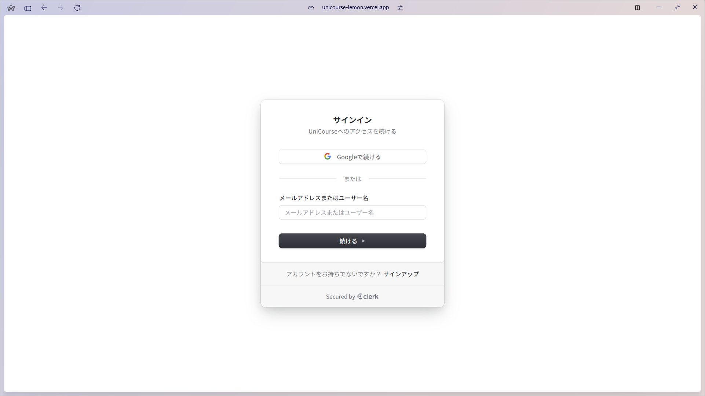

#### アカウント作成ページ

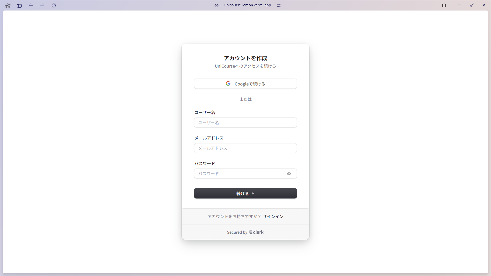

### 共通部

共通部  
　├─　コース作成者向けページ関連の共通部   
　│　　　　サイドバー  
　│　　　　ナビゲーションバー  
　└─　受講者向けページ関連の共通部  
　　　　　サイドバー  
　　　　　ナビゲーションバー  

#### コース作成者向けページ関連の共通部

##### ナビゲーションバー

以下のリンクを表示

- 受講者向けトップページ
- ユーザコントロールアイコン

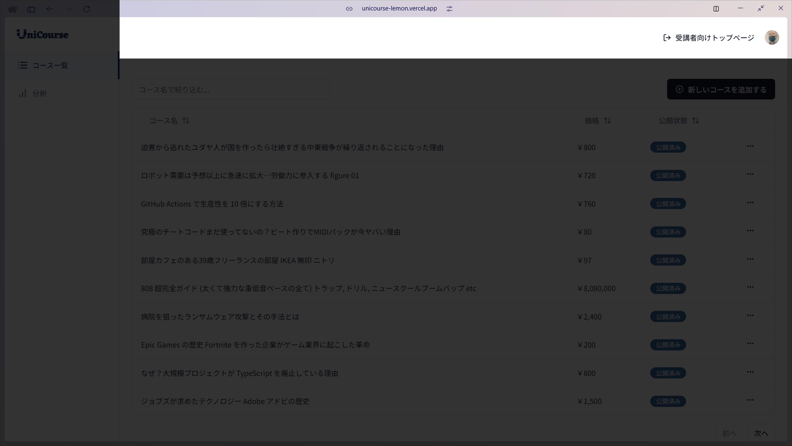

##### サイドバー

以下のリンクを表示

- コース一覧
- 分析

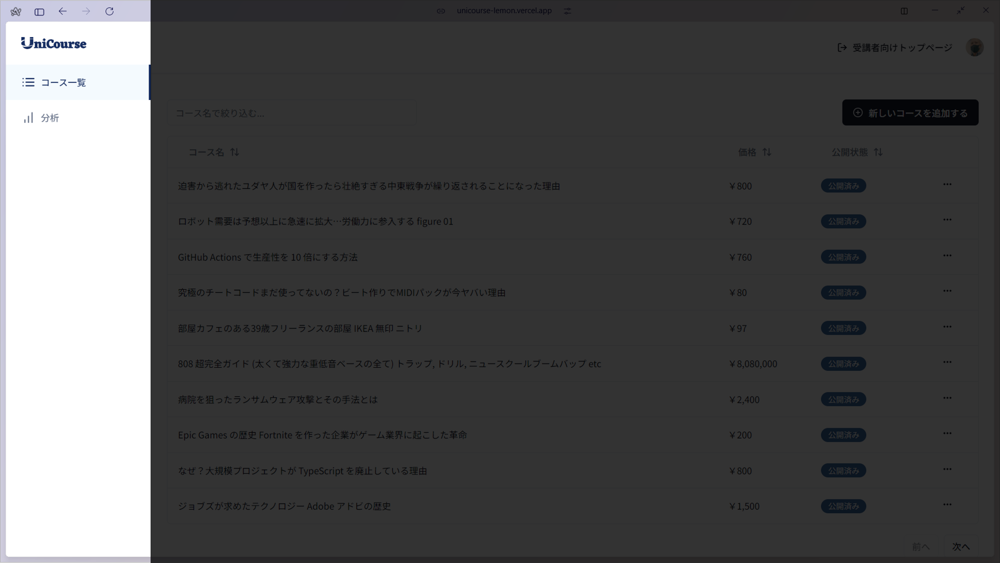

#### 受講者向けページ関連の共通部

##### ナビゲーションバー

以下のリンクを表示

- UniCourseで教える
- ユーザコントロールアイコン

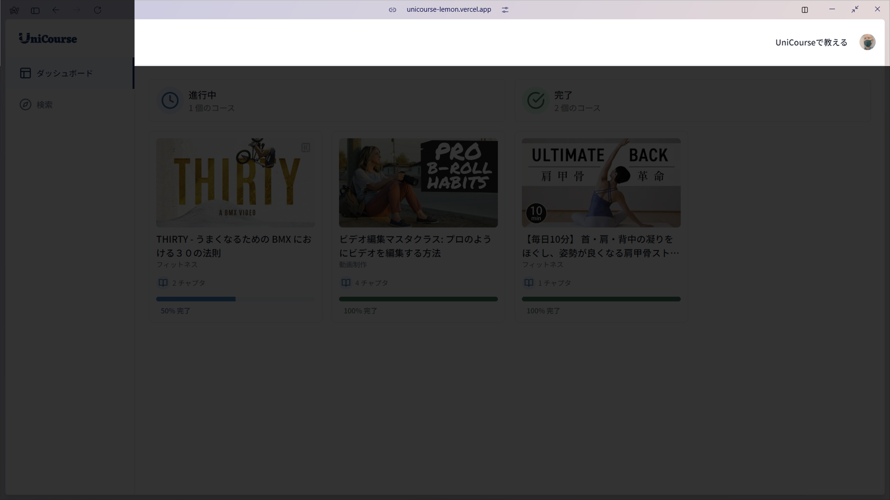

##### サイドバー

以下のリンクを表示

- ダッシュボード
- 検索

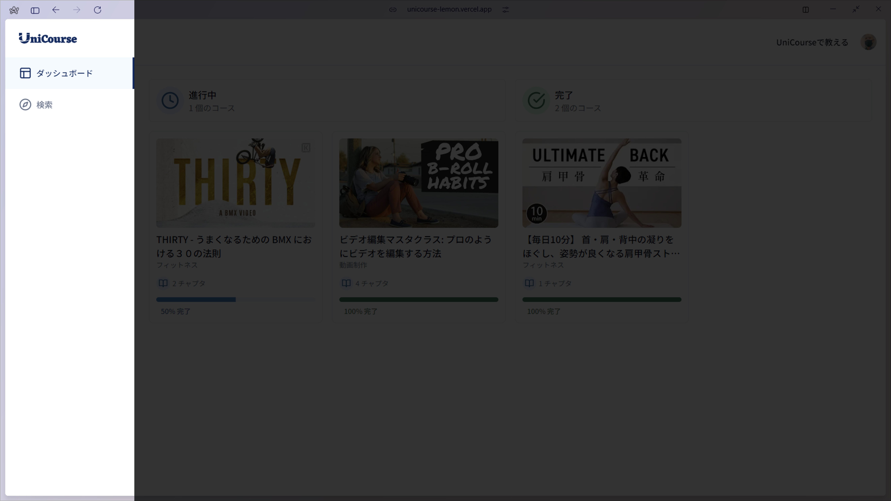

### 受講者向けページ

受講者向けページ  
　│　ダッシュボード  
　│　コース検索ページ  
　│  
　└─　チャプタページ  
　　　　　└─　決済ページ  

#### ダッシュボード

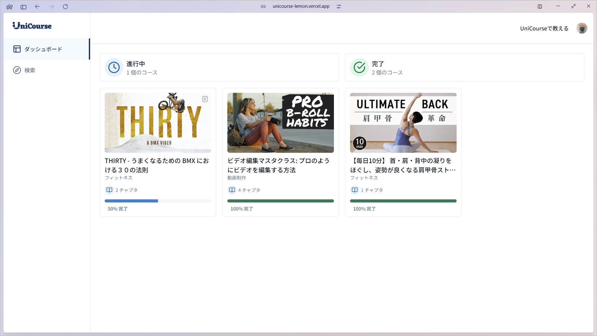

#### コース検索ページ

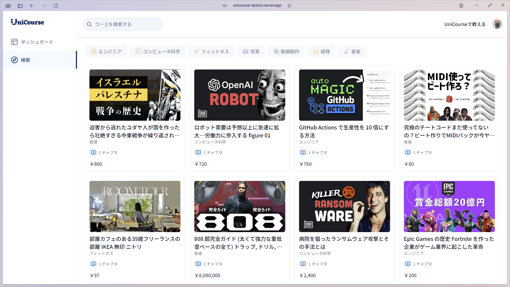

#### チャプタページ

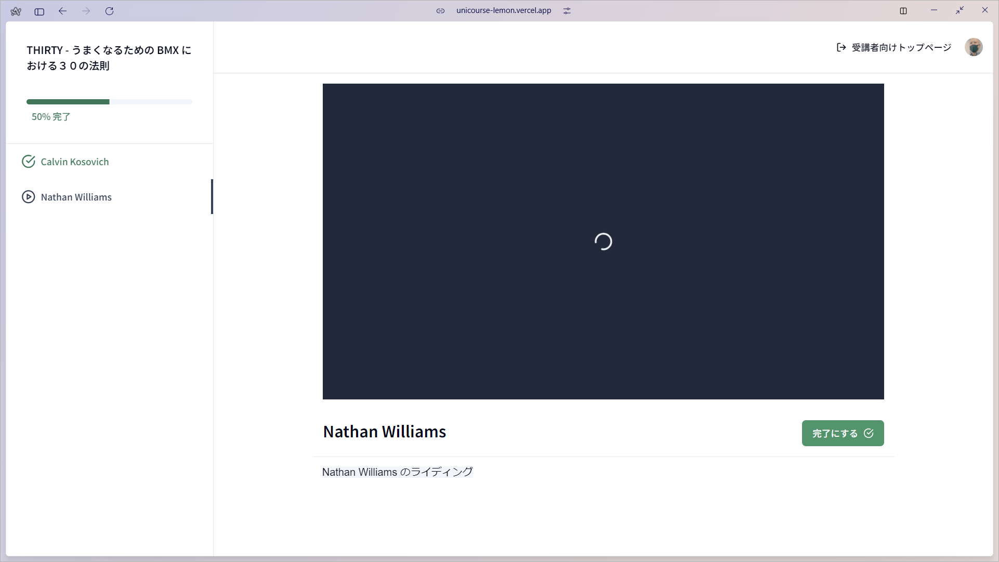

[チャプタページ](#chapter_page) の動画説明を見る

#### 決済ページ

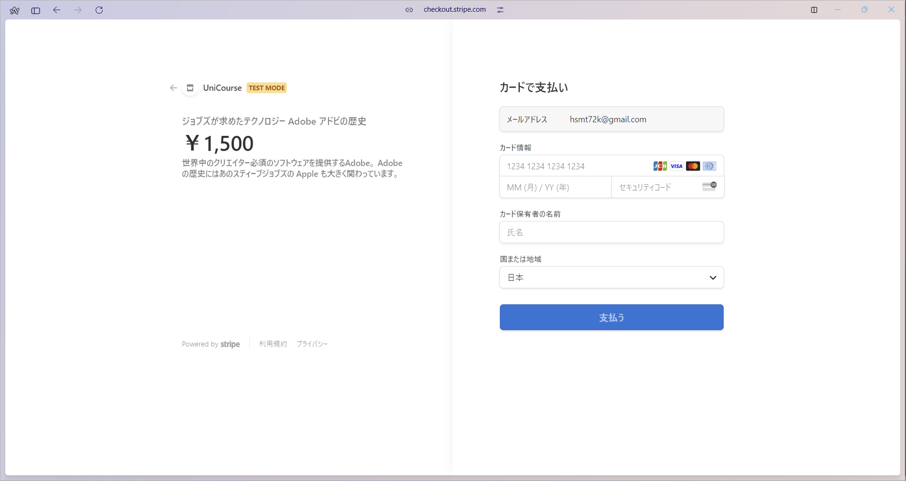

### コース作成者向けページ

#### 作成コース一覧ページ

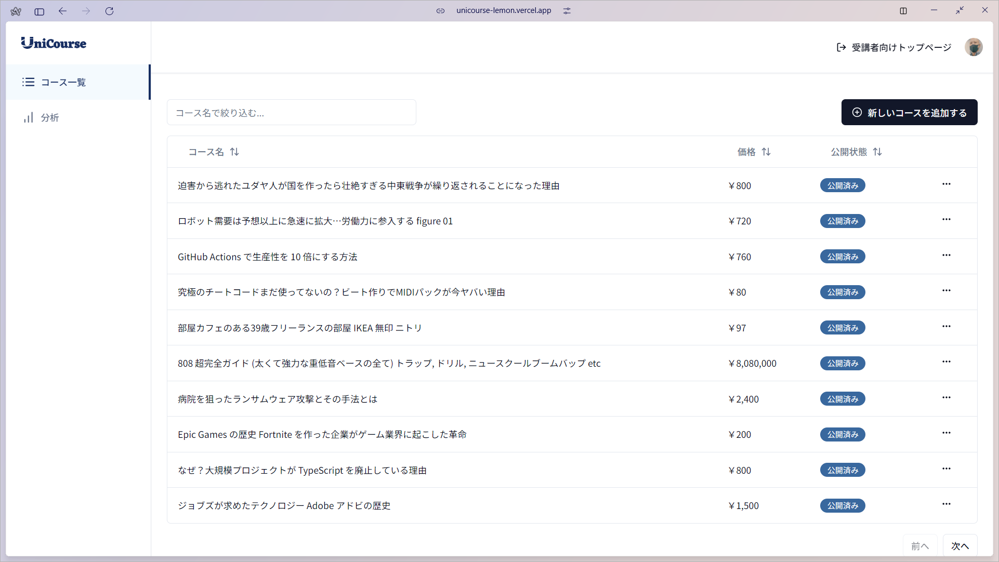

#### コース登録ページ

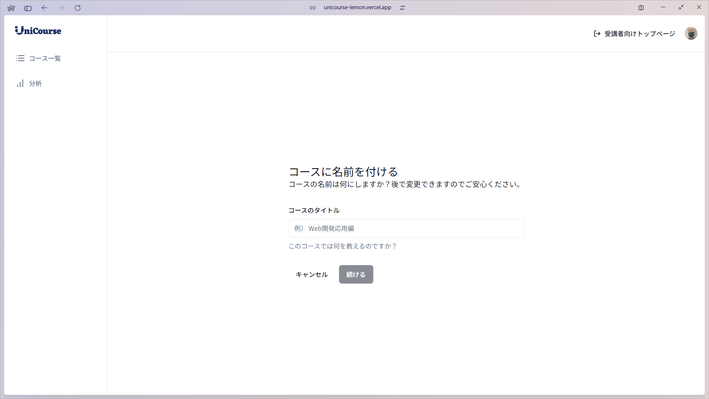

#### コース設定ページ

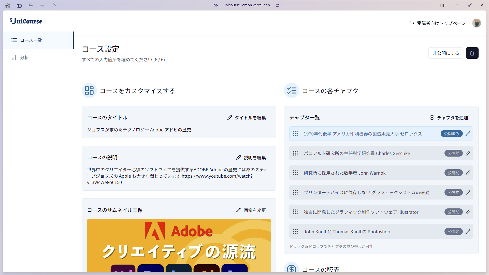

#### チャプタ設定ページ

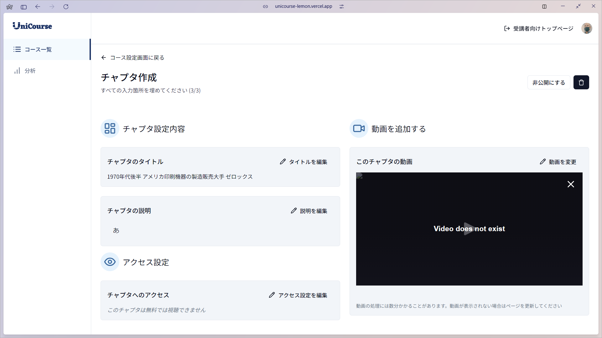

#### 売上分析ページ

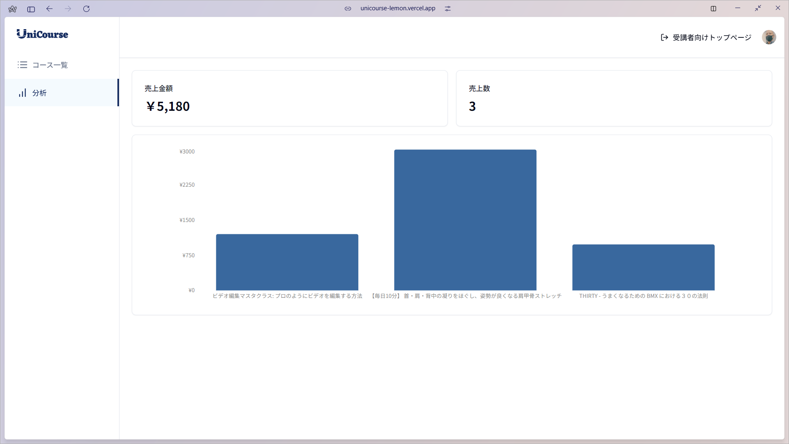

## <a name="example">🚀 各画面説明</a>

### 受講者向けページ  

#### ダッシュボード

#### <a name="chapter_page">チャプタページ</a>

コースを購入していない場合  

<video src="./images/unicourse_page_student_chapter_payment.mp4" controls="true"></video>

コースを購入している場合  

<video src="./images/unicourse_page_student_chapter.mp4" controls="true"></video>

##### サイドバー

- コースのタイトルが表示される

- 公開しているすべてのチャプタのチャプタタイトルが、コース作成者の指定した並び順で表示される

- チャプタの状態（無料公開、動画ロック、完了/未完了）によって、チャプタタイトルのアイコン表示が変化する

##### チャプタの説明

- 動画の下にチャプタのタイトルが表示される

##### チャプタの説明

- 動画の下にチャプタの説明が表示される

##### 添付ファイル

- チャプタの説明の下にコースに設定されている添付ファイルのリンクが表示され、クリックするとファイルをダウンロードできる

##### 動画のロック

- コースを購入していない場合、動画にロックが掛かる

##### 購入ボタン

- 動画を購入していない場合、動画の下にコースの購入ボタンが表示される。

##### バナー

- 動画を購入していない場合、「このチャプタを見るにはコースを購入する必要があります」のメッセージが表示される

- チャプタが完了状態になっている場合、「あなたはすでにこのチャプタを完了にしています」のメッセージが表示される

##### 完了/未完了ボタン

- チャプタが完了状態になっていない場合、「完了にする」ボタンが表示され、クリックするとチャプタが完了状態になる

- 完了状態にすると、次のチャプタに自動的に進む

- チャプタが完了状態になっている場合、「未完了にする」ボタンが表示され、クリックするとチャプタが未完了状態になる

##### 動画再生

## <a name="outro">🤸 おわりに</a>

UniCourse は、オンライン動画学習コースのプラットフォームとしては基本的な機能を備えています。最低限として揃えている機能はシンプルですが、追加で様々な機能を追加しやすいように、拡張性を考えた処理の部品化、表示部品を組み合わせて画面を構築（コンポーネント化）しています。
